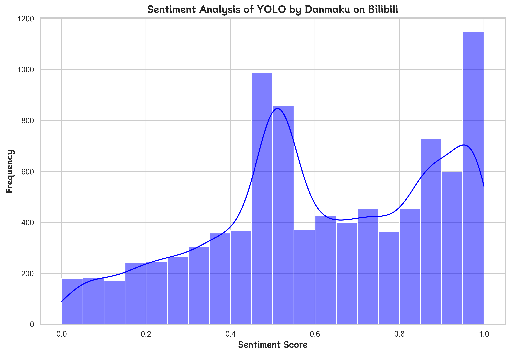

# You Only Live Once (YOLO) Sentiment Analysis by Danmaku on Bilibili

## Background
The 2024 Chinese movie “You Only Live Once” (also known as “YOLO”), directed by Jia Ling and starring Jia Ling herself along with Lei Jiayin, was a significant success. This comedic adaptation of the 2014 Japanese film “100 Yen Love” combines elements of comedy and drama. 

  

The story follows Du Leying, a chronically unemployed woman in her 30s who lives with her family and struggles with depression and self-esteem issues. After a series of personal setbacks, including a painful breakup and a failed appearance on a reality TV show, Leying decides to take control of her life by taking up boxing. She trains rigorously, loses significant weight, and ultimately participates in a boxing match that, despite her loss, earns her respect and a newfound sense of self-worth.

The movie highlights themes of personal transformation, perseverance, and the struggle for self-respect. It also explores family dynamics and societal pressures. The film was well-received, grossing significant box office revenue and becoming a notable release during the Lunar New Year holiday season.

---

## Rationales
“You Only Live Once” (YOLO) was chosen due to its remarkable popularity and the diverse range of public reactions it garnered both before and after its release. Its box office success, grossing over 3.2 billion yuan within the first 15 days of release, underscores its impact and reach among audiences. 

More importantly, critics and audiences had mixed reactions; some praised the film for its inspirational message and Jia Ling’s performance, while others criticized it for perceived gimmicks related to weight loss. The diverse opinions make it a compelling subject for sentiment analysis, reflecting a broad spectrum of public sentiment and discussion.

Bilibili, a leading video-sharing platform in China, offers high objectivity and reliability for collecting audience feedback, especially since the original movie was released officially on the platform. This ensures that the comments and interactions are directly related to the genuine viewing experience. Additionally, Bilibili’s danmaku feature allows viewers to post real-time comments while watching the film, providing a unique and immediate reflection of their emotions and thoughts. 

This real-time interaction is invaluable for sentiment analysis as it captures spontaneous reactions, enhancing the authenticity and depth of the analysis. Studies have shown that danmaku can effectively convey audience instant sentiment and engagement, making it a powerful tool for understanding viewer responses.

---

## Methodologies

### 1. Data Collection
The dataset was collected by scraping danmaku (bullet comments) from Bilibili, a leading video-sharing platform in China. This process involved the following steps:

1. **Scraping Comments**:
   - The script used HTTP requests, simulating a web browser using custom `headers` to bypass restrictions.
   - The raw danmaku data was retrieved in XML format from the platform's API endpoint.

2. **Parsing Data**:
   - XML data was parsed to extract the textual content of danmaku comments.
   - Special characters, formatting inconsistencies, and potential noise in the data were handled through string operations and regular expressions.

### 2. Preprocessing
To prepare the raw data for analysis:

1. **Text Cleaning**:
   - Non-essential symbols, special characters, and punctuation were removed from the text column using the str.replace() method with a regular expression in Python. The pattern [^\w\s] ensures that only alphanumeric characters, underscores, and whitespace are retained.
   - Comments with missing or invalid text were discarded to ensure data quality.

2. **Stopword Removal**:
   - A stopword list tailored for the Chinese language was applied to filter out high-frequency but contextually irrelevant words (e.g., "的", "是", "了").

3. **Word Segmentation**:
   - `jieba`, a popular Chinese NLP library, was employed to segment the danmaku text into meaningful words or phrases.

### 3. Sentiment Analysis
To analyze the sentiment of danmaku comments:

1. **Sentiment Scoring**:
   - Each comment was assigned a sentiment score ranging from 0 (negative sentiment) to 1 (positive sentiment) using the `SnowNLP` library.
   - Invalid or empty comments were excluded to avoid skewing the results.

2. **Sentiment Distribution Visualization**:
   - The sentiment scores were aggregated and visualized using Seaborn's histogram and KDE (Kernel Density Estimation) plots.
   - The plots illustrated the distribution of sentiments, highlighting audience feedback trends.

### 4. Visualization
Several visualizations were employed to better understand audience reactions:

1. **Word Cloud**:
   - A word cloud was generated to highlight the most frequent and prominent words in the danmaku comments.
   - The cloud was customized to match a "cloud" shape, symbolizing the danmaku format.

  

2. **Sentiment Distribution Chart**:
   - A histogram with a KDE overlay was created to visualize the range and density of sentiment scores, providing insights into the overall reception of the video.

  

### 5. Error Handling
Throughout the workflow, robust error-handling mechanisms were implemented:

1. **Data Parsing**:
   - Errors arising from malformed XML or missing fields were caught and logged, ensuring a smooth scraping and parsing process.

2. **Sentiment Analysis**:
   - Empty or invalid comments were skipped to prevent exceptions during sentiment scoring (e.g., division by zero in `SnowNLP`).

3. **Scalability**:
   - The scraping and processing pipeline was optimized to handle large volumes of danmaku efficiently, enabling scalability for future analyses.

### Key Libraries and Tools
1. **Data Collection**: `requests`, `xml.etree.ElementTree`
2. **Text Preprocessing**: `jieba`
3. **Sentiment Analysis**: `SnowNLP`
4. **Visualization**: `Seaborn`, `Matplotlib`, `WordCloud`

---

## Results

### Word Cloud Visualization
The word cloud highlights the most frequently used words in the danmaku comments for the movie "YOLO". Larger words indicate higher frequency and importance. It provides a quick visual representation of audience focus and key themes.

### Sentiment Analysis Distribution
The sentiment analysis distribution chart illustrates the emotional responses from the danmaku comments. The x-axis represents the sentiment scores ranging from 0 (negative) to 1 (positive), while the y-axis represents the frequency of comments for each sentiment score range. The chart shows two major peaks:
1. A peak near 0.5, indicating neutral or slightly negative comments.
2. A peak near 1.0, showing a significant proportion of positive comments.

---

## Conclusions and Discussions

### Conclusions
1. **Audience Sentiments**:
   - The sentiment analysis revealed that a significant proportion of danmaku comments are positive, with a peak near 1.0. This indicates that "YOLO" was well-received by a large portion of the audience.
   - A secondary peak near 0.5 suggests some neutral or slightly negative comments, reflecting diverse audience reactions.

2. **Key Audience Focus**:
   - The word cloud visualization highlights words like "真实" (realistic), "喜欢" (like), and "自己" (self), suggesting that viewers resonate with the movie's authenticity, themes of self-improvement, and relatability.
   - Other prominent words such as "教练" (coach) and "买房" (buying a house) reflect specific elements or themes of the movie that sparked audience engagement.

### Discussions
1. **Cultural Resonance**:
   - The themes of personal transformation and societal pressures (e.g., housing struggles and self-esteem) seem to resonate deeply with viewers, as reflected by the most frequently used words in the danmaku comments.

2. **Diverse Reactions**:
   - While most comments are positive, the peak near 0.5 in the sentiment distribution indicates a subset of viewers expressing neutral or slightly negative sentiments. This could stem from differing opinions about the movie’s plot, pacing, or other elements.

3. **Utility of Danmaku Analysis**:
   - The combination of word clouds and sentiment analysis demonstrates the value of danmaku as a rich source of audience feedback. It provides real-time insights into viewer emotions and reactions that traditional review platforms may overlook.

4. **Potential Improvements**:
   - To address the neutral and negative sentiments, filmmakers could analyze specific criticisms (e.g., words from the 0.4-0.5 sentiment range) to identify areas for improvement in future productions.

5. **Broader Implications**:
   - This study shows the potential of leveraging danmaku data for sentiment analysis in other films or media. It highlights the importance of understanding audience feedback not just for content improvement but also for exploring cultural and societal impacts.

